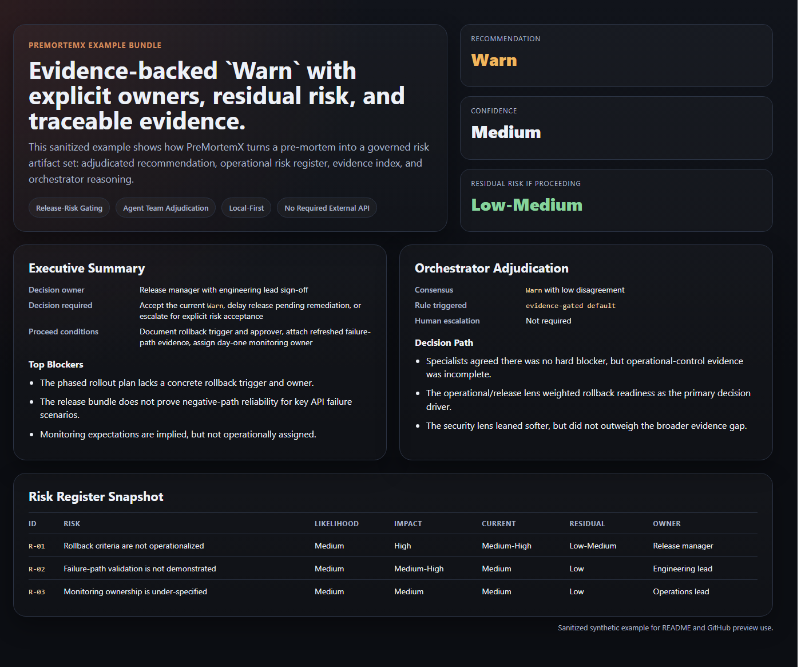
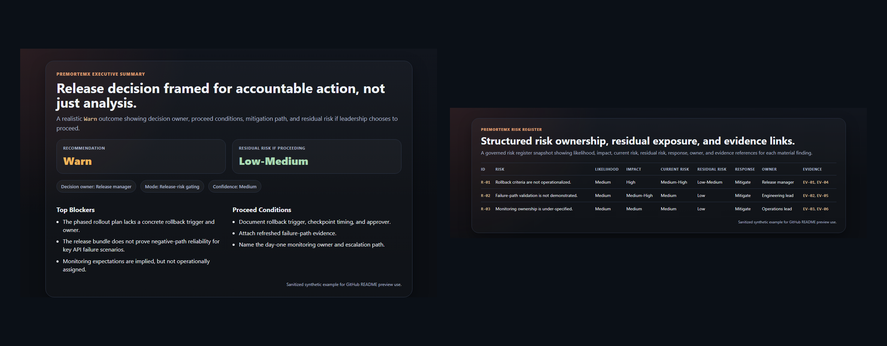
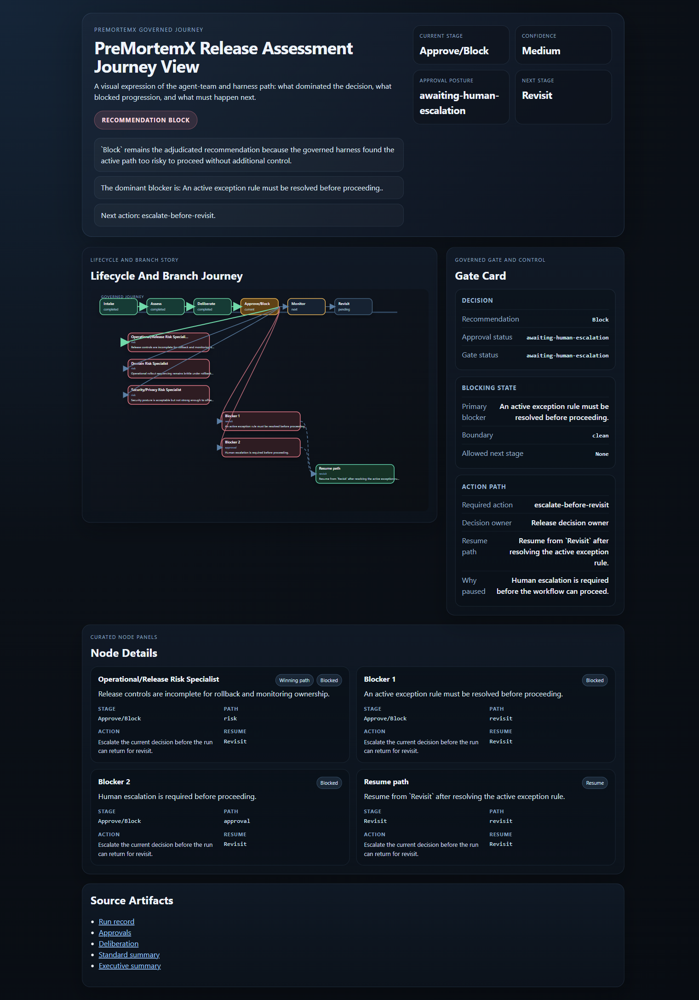
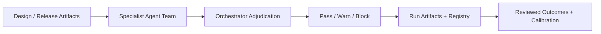

<div align="center">

# PreMortemX

### Evidence-backed pre-mortem risk analysis for Codex, with orchestrated adjudication, governed calibration, and a Python-first cross-platform runtime.

[](plugins/premortemx/.codex-plugin/plugin.json)
[](https://github.com/ai-craftsman404/PreMortemX/actions/workflows/ci.yml)
[](plugins/premortemx/.codex-plugin/plugin.json)
[](LICENSE)

[**Quick Start**](#quick-start) · [**Real Example Bundle**](#real-example-bundle) · [**Why PreMortemX**](#why-premortemx) · [**Example Output**](#example-output) · [**Plugin Docs**](#plugin-docs)


<sub>Operating model: evidence flows through specialist agents, centralized adjudication, and gated recommendation output.</sub>

</div>

---

## The Problem

Risk assessment is a well-established engineering discipline, but it is often slow, inconsistent, and hard to operationalize inside day-to-day AI-assisted workflows.

**PreMortemX brings that discipline into Codex.** It uses specialist AI risk lenses, orchestrated adjudication, evidence-backed outputs, and governed calibration so teams can move faster without treating risk analysis like generic AI brainstorming.

It is fully usable in local-first mode with no required external API dependency.

---

## Why PreMortemX

- uses established risk-assessment practice instead of inventing a new methodology
- translates that practice into a Codex-native plugin workflow
- adjudicates through an orchestrator instead of naive vote counting
- keeps decisions readable, evidence-backed, and auditable
- supports calibration over time through reviewed runs and controlled promotion

### What `v5` adds

- governed prompt, workflow, and runtime asset layers
- active workflow gating for assess-entry and handoff completeness
- active boundary/context enforcement for blocked, quarantined, and transformed context
- operator-facing `start-here` run landing with gate, approval, and resume cues
- blocker-aware next-action guidance aligned across summaries and approvals
- stronger synthetic and adversarial assurance coverage for mixed blockers, malformed context markers, remediation transitions, and cross-artifact consistency
- bounded sub-agent assurance reviews used to identify high-risk permutation gaps before hardening the runtime and tests

### What early `v6a` adds

- a first visual risk-journey surface derived from canonical governed run artifacts
- a lifecycle rail, branch journey, gate card, and resume path in one local artifact
- a stronger visible expression of the agent-team and harness model, not just the underlying reports

### Trust Boundary

- works in local-first mode with no required external API dependency
- has no built-in network dependency for normal operation
- uses human-governed approvals before broader access or higher-permission behavior
- keeps final release or architecture decisions human-governed, not autonomous

### Who this is for

- teams making release or architecture decisions with real accountability
- engineering leads who need readable, evidence-backed `Pass` / `Warn` / `Block` outputs
- higher-governance or regulated environments where traceability matters

### Who this is not for

- generic brainstorming without a concrete artifact bundle
- fully autonomous release authority without human governance
- teams looking only for a lightweight prompt template

---

## Quick Start

### 30-Second Path

1. Open the repo root in Codex.
2. Enable `PreMortemX` in the Plugins UI.
3. Paste this:

```text
$premortemx Validate this architecture and identify the top design risks before implementation.
```

4. Expect:

- a bounded architecture-artifact check instead of guessing
- an adjudicated `Pass` / `Warn` / `Block` style outcome
- governed artifact generation for deeper review

### Full Quick Start

1. Clone or download this repo.
2. Open the repo in Codex.
3. Install or enable `PreMortemX` from the Codex Plugins UI.
4. Run this smoke test first:

```text
$premortemx Smoke test this plugin and confirm it is active.
```

5. Then use a real prompt such as:

```text
$premortemx Validate this architecture and identify the top design risks before implementation.
```

<details>
<summary>Install notes and platform details</summary>

- open the repo root, not only the nested plugin folder
- Codex discovery depends on `.agents/plugins/marketplace.json` being present at the repo root
- after opening the repo, check the Codex Plugins UI for `PreMortemX`
- if the plugin does not appear, reopen the repo root and confirm `.agents/plugins/marketplace.json` is still present
- `v4` is Python-first
- the Python runtime is the default execution path for normal plugin use
- the legacy PowerShell runtime is preserved as fallback compatibility
- Windows is validated
- Linux is validated through the Python runtime path
- macOS is reasonably expected to work through Python, but is not yet validated end to end

</details>

---

## Real Example Bundle

Review a committed sanitized `v5` governed example bundle here:





- [Executive summary](plugins/premortemx/examples/sample-warn-release/summary-exec.md)
- [Standard summary](plugins/premortemx/examples/sample-warn-release/summary-standard.md)
- [Start here](plugins/premortemx/examples/sample-warn-release/start-here.md)
- [Approvals](plugins/premortemx/examples/sample-warn-release/approvals.json)
- [Risk register](plugins/premortemx/examples/sample-warn-release/risk-register.md)
- [Evidence index](plugins/premortemx/examples/sample-warn-release/evidence-index.md)
- [Deliberation artifact](plugins/premortemx/examples/sample-warn-release/deliberation.json)

This is a realistic `Warn` example, included so visitors can inspect the current `v5` governed run surface before installing the plugin:

- `start-here` landing flow
- gate and approval cues
- continue / resume guidance
- risk register depth
- adjudication artifact shape
- governed workflow and boundary state

### `v6a` Journey Surface Preview

This is the first visual journey-view artifact generated from a governed `Block` run:



- [Journey example README](plugins/premortemx/examples/sample-block-journey/README.md)
- [Journey view HTML](plugins/premortemx/examples/sample-block-journey/journey-view.html)
- [Journey view JSON](plugins/premortemx/examples/sample-block-journey/journey-view.json)
- [Journey start-here](plugins/premortemx/examples/sample-block-journey/start-here.md)
- [Journey approvals](plugins/premortemx/examples/sample-block-journey/approvals.json)

This preview is important because it shows `PreMortemX` as more than a report generator:

- the agent-team and harness path is visible
- blocker precedence is visible
- resume and re-entry behavior is visible
- the visual layer is still derived from auditable governed artifacts

---

## Example Output

Example adjudicated outcome shape:

```text
Recommendation: Block
Confidence: Medium-High

Top blockers:
- Sensitive path lacks sufficient evidence-backed controls.
- Policy fit is weak for a high-sensitivity release path.

Mitigation path:
- strengthen evidence coverage
- resolve the security review gap
- rerun the gate with updated artifacts
```

Example operating model:



---

## Version Evolution

| Version | Main focus | What changed |
|------|------|------|
| `v1` | Release-first pre-mortem gating | Added `Pass` / `Warn` / `Block`, structured artifacts, local registry, and override handling |
| `v2` | Broader assessment coverage | Added `architecture-validation`, stronger registry views, guardrail recommendations, quality review logging, and trend summaries |
| `v3` | Governed decision system | Added specialist agent-team deliberation, orchestrator adjudication, calibration storage, promotion states, and approval-controlled calibration changes |
| `v4` | Cross-platform runtime | Moved to a Python-first runtime, kept PowerShell fallback, and validated Windows plus Linux runtime behavior |
| `v5` | Governed execution environment | Added prompt/workflow/runtime asset layers, gate-state enforcement, boundary/context controls, stronger operator-facing run artifacts, and higher-assurance synthetic/adversarial validation |
| `v6a` | Visual risk journey | Added the first derived `journey-view` surface with lifecycle rail, branch flow, gate control, and resume-path visualization |

---

## Repo Layout

```text
.agents/plugins/marketplace.json
plugins/premortemx/
```

This repo is intentionally minimal and contains only the standalone public plugin package plus the local marketplace metadata needed for Codex discovery.

---

## Plugin Docs

Full plugin documentation lives here:

- [plugins/premortemx/README.md](plugins/premortemx/README.md)
- [plugins/premortemx/CHANGELOG.md](plugins/premortemx/CHANGELOG.md)
- [plugins/premortemx/TEST-MATRIX.md](plugins/premortemx/TEST-MATRIX.md)
- [plugins/premortemx/SECURITY-REVIEW.md](plugins/premortemx/SECURITY-REVIEW.md)
