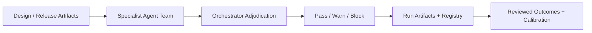

<div align="center">

# PreMortemX

### Evidence-backed pre-mortem risk analysis for Codex, with orchestrated adjudication and governed calibration.

[](plugins/premortemx/.codex-plugin/plugin.json)
[](https://github.com/ai-craftsman404/PreMortemX/actions/workflows/ci.yml)
[](plugins/premortemx/.codex-plugin/plugin.json)
[](LICENSE)

[**Quick Start**](#quick-start) · [**Why PreMortemX**](#why-premortemx) · [**Example Output**](#example-output) · [**Plugin Docs**](#plugin-docs)

</div>

---

## The Problem

Risk assessment is a well-established engineering discipline, but it is often slow, inconsistent, and hard to operationalize inside day-to-day AI-assisted workflows.

**PreMortemX brings that discipline into Codex.** It uses specialist AI risk lenses, orchestrated adjudication, evidence-backed outputs, and governed calibration so teams can move faster without treating risk analysis like generic AI brainstorming.

It is fully usable in local-first mode with no required external API dependency.

---

## Why PreMortemX

- uses established risk-assessment practice instead of inventing a new methodology
- translates that practice into a Codex-native plugin workflow
- adjudicates through an orchestrator instead of naive vote counting
- keeps decisions readable, evidence-backed, and auditable
- supports calibration over time through reviewed runs and controlled promotion

### Who this is for

- teams making release or architecture decisions with real accountability
- engineering leads who need readable, evidence-backed `Pass` / `Warn` / `Block` outputs
- higher-governance or regulated environments where traceability matters

### Who this is not for

- generic brainstorming without a concrete artifact bundle
- fully autonomous release authority without human governance
- teams looking only for a lightweight prompt template

---

## Quick Start

1. Clone or download this repo.
2. Open the repo in Codex.
3. Install or enable `PreMortemX` from the Codex Plugins UI.
4. Use a prompt such as:

```text
$premortemx Validate this architecture and identify the top design risks before implementation.
```

---

## Example Output

Example adjudicated outcome shape:

```text
Recommendation: Block
Confidence: Medium-High

Top blockers:
- Sensitive path lacks sufficient evidence-backed controls.
- Policy fit is weak for a high-sensitivity release path.

Mitigation path:
- strengthen evidence coverage
- resolve the security review gap
- rerun the gate with updated artifacts
```

Example operating model:



---

## Repo Layout

```text
.agents/plugins/marketplace.json
plugins/premortemx/
```

This repo is intentionally minimal and contains only the standalone public plugin package plus the local marketplace metadata needed for Codex discovery.

---

## Plugin Docs

Full plugin documentation lives here:

- [plugins/premortemx/README.md](plugins/premortemx/README.md)
- [plugins/premortemx/CHANGELOG.md](plugins/premortemx/CHANGELOG.md)
- [plugins/premortemx/TEST-MATRIX.md](plugins/premortemx/TEST-MATRIX.md)
- [plugins/premortemx/SECURITY-REVIEW.md](plugins/premortemx/SECURITY-REVIEW.md)
